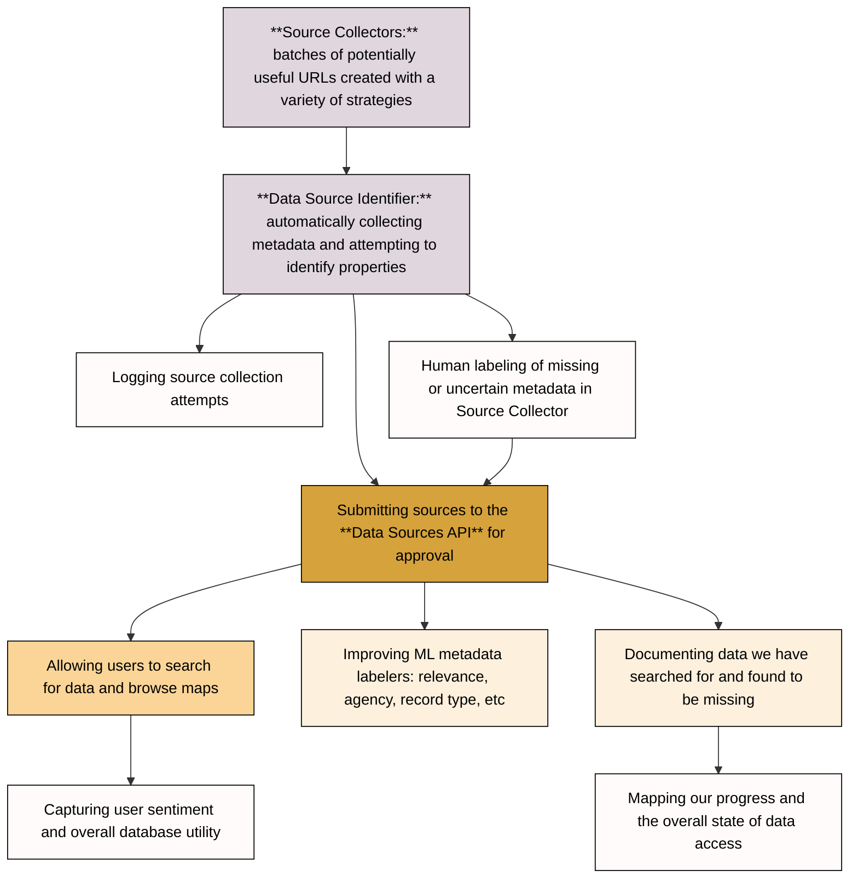
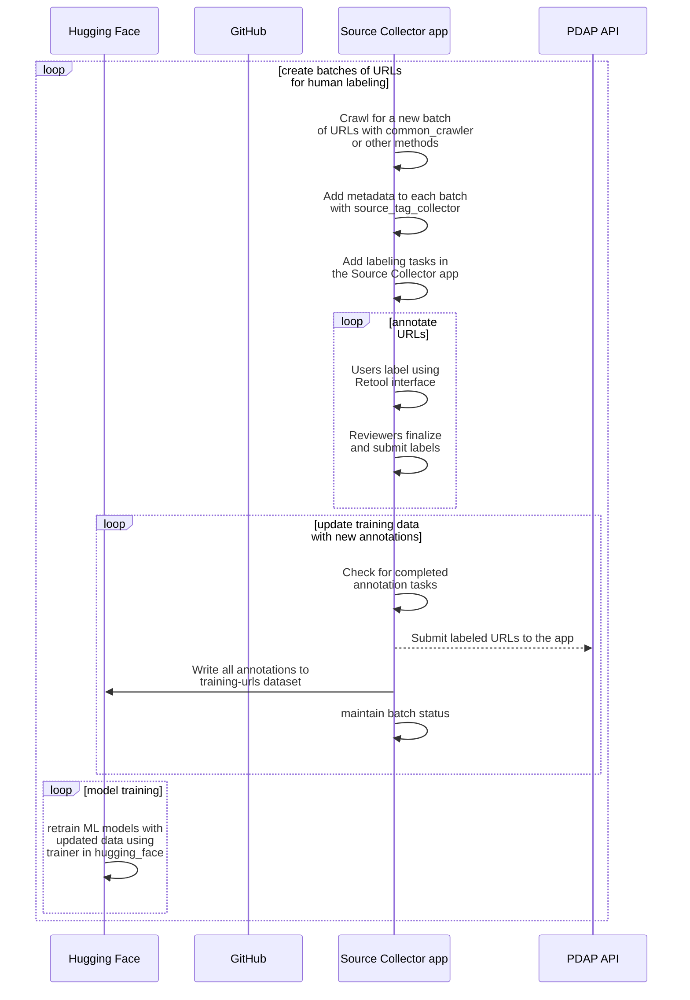

This is a multi-language repo containing scripts or tools for identifying and cataloguing Data Sources based on their URL and HTML content.

# Index

name | description of purpose
--- | ---
.github/workflows | Scheduling and automation
agency_identifier | Matches URLs with an agency from the PDAP database
annotation_pipeline | Automated pipeline for generating training data in our ML data source identification models. Manages common crawl, HTML tag collection, and Label Studio import/export
html_tag_collector | Collects HTML header, meta, and title tags and appends them to a JSON file. The idea is to make a richer dataset for algorithm training and data labeling.
hugging_face | Utilities for interacting with our machine learning space at [Hugging Face](https://huggingface.co/PDAP)
identification_pipeline.py | The core python script uniting this modular pipeline. More details below.
openai-playground | Scripts for accessing the openai API on PDAP's shared account
source_collectors| Tools for extracting metadata from different sources, including CKAN data portals and Common Crawler
collector_db | Database for storing data from source collectors
collector_manager | A module which provides a unified interface for interacting with source collectors and relevant data
core | A module which integrates other components, such as collector_manager and collector_db
api | API for interacting with collector_manager, core, and collector_db
local_database | Resources for setting up a test database for local development

## How to use

1. Create an .env file in this directory with these contents, or set the environment variable another way: `VUE_APP_PDAP_API_KEY=KeyGoesHere`
2. Create a file in this directory containing a list of urls to be identified, or modify the existing `urls.csv` file. This requires one URL per line with at least a `url` column.
3. Run `python3 identification_pipeline.py urls.csv`
4. Results will be written in the same directory as results.csv
5. If importing "identification_pipeline_main" function, it expects a dataframe as an argument and returns a resulting dataframe

# Contributing

Thank you for your interest in contributing to this project! Please follow these guidelines:

- If you want to work on something, create an issue first so the broader community can discuss it.
- If you make a utility, script, app, or other useful bit of code: put it in a top-level directory with an appropriate name and dedicated README and add it to the index.

# Testing

Note that prior to running tests, you need to install [Docker](https://docs.docker.com/get-started/get-docker/) and have the Docker engine running.

Tests can be run by spinning up the `docker-compose-test.yml` file in the root directory. This will start a two-container setup, consisting of the FastAPI Web App and a clean Postgres Database. 

This can be done via the following command:

```bash
docker compose up -d
```

Following that, you will need to set up the uvicorn server using the following command:

```bash
docker exec data-source-identification-app-1 uvicorn api.main:app --host 0.0.0.0 --port 80
```

Note that while the container may mention the web app running on `0.0.0.0:8000`, the actual host may be `127.0.0.1:8000`.

To access the API documentation, visit `http://{host}:8000/docs`.

To run tests on the container, run:

```bash
docker exec data-source-identification-app-1 pytest /app/tests/test_automated
```

Be sure to inspect the `docker-compose.yml` file in the root directory -- some environment variables are dependant upon the Operating System you are using.

# Diagrams

## Identification pipeline plan



## Training models by batching and annotating URLs



# Docstring and Type Checking

Docstrings and Type Checking are checked using the [pydocstyle](https://www.pydocstyle.org/en/stable/) and [mypy](https://mypy-lang.org/)
modules, respectively. When making a pull request, a Github Action (`python_checks.yml`) will run and, 
if it detects any missing docstrings or type hints in files that you have modified, post them in the Pull Request.

These will *not* block any Pull request, but exist primarily as advisory comments to encourage good coding standards.

Note that `python_checks.yml` will only function on pull requests made from within the repo, not from a forked repo.
