This is a multi-language repo containing scripts or tools for identifying Data Sources by their URL and HTML content.

# Index

name | description of purpose
--- | ---
Identification Pipeline | The core python script of a modular pipeline. More details below.
hf_testing | Utilities for interacting with our machine learning space at [Hugging Face](https://huggingface.co/PDAP)
HTML tag collector | Collects HTML header, meta, and title tags and appends them to a JSON file. The idea is to make a richer dataset for algorithm training and data labeling.
ML URL Classifier (work in progress) | Classifies a set of URLs given by a CSV file using the KNN and Logistic Regression algorithms. This is a work in progress with one function experiment on a small labeled dataset (~400 observations, 1 feature, 2 classes). Pending progress involves testing the existing workflow in `main.ipynb` against a larger labeled dataset and including more labels in the classification problem.
openai-playground | Scripts for accessing the openai API on PDAP's shared account

# Identification pipeline
In an effort to build out a fully automated system for identifying and cataloguing new data sources, this pipeline:
- Checks potential new data sources against all those already in the database
- Runs non-duplicate sources through the `HTML tag collector` for use in ML training
- Checks the hostnames against those of the agencies in the database

## How to use

1. Create an .env file in this directory with these contents, or set the environment variable another way: `VUE_APP_PDAP_API_KEY=KeyGoesHere`
2. Create a file in this directory containing a list of urls to be identified, or modify the existing `urls.csv` file. This requires one URL per line with at least a `url` column.
3. Run `python3 identification_pipeline.py urls.csv`
4. Results will be written in the same directory as results.csv
5. If importing "identification_pipeline_main" function, it expects a dataframe as an argument and returns a resulting dataframe

# Contributing

Thank you for your interest in contributing to this project! Please follow these guidelines:

- If you want to work on something, create an issue first so the broader community can discuss it.
- If you make a utility, script, app, or other useful bit of code: put it in a top-level directory with an appropriate name and dedicated README and add it to the index.

# Pipeline flow & operations

Each of these steps may be attempted with regex, human identification, or machine learning.

We combine several machine learning (ML) models, each focusing on a specific task or property.

```mermaid
%% Here's a guide to mermaid syntax: https://mermaid.js.org/syntax/flowchart.html

flowchart TD
0["Human-label batches
using an annotation pipeline
to train ML models on specific
tasks or properties"]
A["Start with a batch of URLs
in JSON format, from common
crawl or another source"]
B["Check for duplicates in the
pipeline's training data
/ our database"]
C["Make an HTTP request to
each URL in the JSON batch
and append some metadata"]
D["Determine whether the URL
is “relevant”, i.e. a source of
data about one of our `agency_types`
(police, courts, jails)"]
E["Determine if this is an
`individual record`. We're only
looking for data sources, of which
individual records are children."]
F["Determine which `agency`
is described"]
G["Define `name`, `description`,
`record_type`"]
H["Identify other metadata
using on our pipeline"]
I["Submit Data Sources with `agency`,
`name`, `description`, and
`record_type` to the approval queue"]
J["Manually approve or reject
data source submissions"]
K["Retrain models with approved
submissions, particularly
adjustments made before
approval & rejections"]
reject["Reject the URL"]
manual["Human-identify and
resubmit"]

C --> 0

subgraph Prepare URLs for labeling or identification
A --> B
B --> C
end

C --> D
D -- not relevant --> reject
E -- individual record --> reject

subgraph Use ML models to ID data
D -- yes --> E
E --> F
F --> G
G --> H
end

F -- cannot identify --> manual
G -- cannot identify --> manual
manual --> H
H --> I

subgraph approve & submit
I --> J
J --> K
end
```

